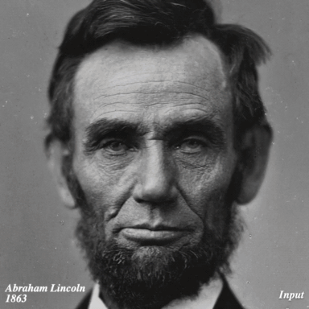

# [SIGGRAPH Asia 2021] Time-Travel Rephotography
<a href="https://arxiv.org/abs/2012.12261"></a>
<a href="https://opensource.org/licenses/MIT"></a>
[](https://colab.research.google.com/drive/15D2WIF_vE2l48ddxEx45cM3RykZwQXM8?usp=sharing)
### [[Project Website](https://time-travel-rephotography.github.io/)]

<p align='center'>

</p>

Many historical people were only ever captured by old, faded, black and white photos, that are distorted due to the limitations of early cameras and the passage of time. This paper simulates traveling back in time with a modern camera to rephotograph famous subjects. Unlike conventional image restoration filters which apply independent operations like denoising, colorization, and superresolution, we leverage the StyleGAN2 framework to project old photos into the space of modern high-resolution photos, achieving all of these effects in a unified framework. A unique challenge with this approach is retaining the identity and pose of the subject in the original photo, while discarding the many artifacts frequently seen in low-quality antique photos. Our comparisons to current state-of-the-art restoration filters show significant improvements and compelling results for a variety of important historical people. 
<br/>

**Time-Travel Rephotography**
<br/>
[Xuan Luo](https://roxanneluo.github.io),
[Xuaner Zhang](https://people.eecs.berkeley.edu/~cecilia77/),
[Paul Yoo](https://www.linkedin.com/in/paul-yoo-768a3715b),
[Ricardo Martin-Brualla](http://www.ricardomartinbrualla.com/),
[Jason Lawrence](http://jasonlawrence.info/), and 
[Steven M. Seitz](https://homes.cs.washington.edu/~seitz/)
<br/>
In SIGGRAPH Asia 2021.

## Demo
We provide an easy-to-get-started demo using Google Colab!
The Colab will allow you to try our method on the sample Abraham Lincoln photo or **your own photos** using Cloud GPUs on Google Colab.

[](https://colab.research.google.com/drive/15D2WIF_vE2l48ddxEx45cM3RykZwQXM8?usp=sharing)

Or you can run our method on your own machine following the instructions below.
 
## Prerequisite
- Pull third-party packages.
  ```
  git submodule update --init --recursive
  ```
- Install python packages.
  ```
  conda create --name rephotography python=3.8.5
  conda activate rephotography
  conda install pytorch==1.4.0 torchvision==0.5.0 cudatoolkit=10.1 -c pytorch
  pip install -r requirements.txt
  ```

## Quick Start
Run our method on the example photo of Abraham Lincoln.
- Download models:
  ```
  ./scripts/download_checkpoint.sh
  ```
- Run:
  ```
  ./scripts/run.sh b "dataset/Abraham Lincoln_01.png" 0.75 
  ```
- You can inspect the optimization process by  
  ```
  tensorboard --logdir "log/Abraham Lincoln_01"
  ```
- You can find your results as below.
  ```
  results/
    Abraham Lincoln_01/       # intermediate outputs for histogram matching and face parsing
    Abraham Lincoln_01_b.png  # the input after matching the histogram of the sibling image
    Abraham Lincoln_01-b-G0.75-init(10,18)-s256-vgg1-vggface0.3-eye0.1-color1.0e+10-cx0.1(relu3_4,relu2_2,relu1_2)-NR5.0e+04-lr0.1_0.01-c32-wp(250,750)-init.png        # the sibling image
    Abraham Lincoln_01-b-G0.75-init(10,18)-s256-vgg1-vggface0.3-eye0.1-color1.0e+10-cx0.1(relu3_4,relu2_2,relu1_2)-NR5.0e+04-lr0.1_0.01-c32-wp(250,750)-init.pt         # the sibing latent codes and initialized noise maps
    Abraham Lincoln_01-b-G0.75-init(10,18)-s256-vgg1-vggface0.3-eye0.1-color1.0e+10-cx0.1(relu3_4,relu2_2,relu1_2)-NR5.0e+04-lr0.1_0.01-c32-wp(250,750).png             # the output result
    Abraham Lincoln_01-b-G0.75-init(10,18)-s256-vgg1-vggface0.3-eye0.1-color1.0e+10-cx0.1(relu3_4,relu2_2,relu1_2)-NR5.0e+04-lr0.1_0.01-c32-wp(250,750).pt              # the final optimized latent codes and noise maps
    Abraham Lincoln_01-b-G0.75-init(10,18)-s256-vgg1-vggface0.3-eye0.1-color1.0e+10-cx0.1(relu3_4,relu2_2,relu1_2)-NR5.0e+04-lr0.1_0.01-c32-wp(250,750)-rand.png        # the result with the final latent codes but random noise maps

  ```

## Run on Your Own Image
- Crop and align the head regions of your images:
  ```
  python -m tools.data.align_images <input_raw_image_dir> <aligned_image_dir>
  ```
- Run:
  ```
  ./scripts/run.sh <spectral_sensitivity> <input_image_path> <blur_radius>
  ```
  The `spectral_sensitivity` can be `b` (blue-sensitive), `gb` (orthochromatic), or `g` (panchromatic). You can roughly estimate the `spectral_sensitivity` of your photo as follows. Use the *blue-sensitive* model for photos before 1873, manually select between blue-sensitive and *orthochromatic* for images from 1873 to 1906 and among all models for photos taken afterwards.

  The `blur_radius` is the estimated gaussian blur radius in pixels if the input photot is resized to 1024x1024.
  
## Historical Wiki Face Dataset
| Path      | Size | Description |
|----------- | ----------- | ----------- |
| [Historical Wiki Face Dataset.zip](https://drive.google.com/open?id=1mgC2U7quhKSz_lTL97M-0cPrIILTiUCE&authuser=xuanluo%40cs.washington.edu&usp=drive_fs)| 148 MB | Images|
| [spectral_sensitivity.json](https://drive.google.com/open?id=1n3Bqd8G0g-wNpshlgoZiOMXxLlOycAXr&authuser=xuanluo%40cs.washington.edu&usp=drive_fs)| 6 KB | Spectral sensitivity (`b`, `gb`, or `g`). |
| [blur_radius.json](https://drive.google.com/open?id=1n4vUsbQo2BcxtKVMGfD1wFHaINzEmAVP&authuser=xuanluo%40cs.washington.edu&usp=drive_fs)| 6 KB | Blur radius in pixels| 

The `json`s are dictionares that map input names to the corresponding spectral sensitivity or blur radius.
Due to copyright constraints, `Historical Wiki Face Dataset.zip` contains all images in the *Historical Wiki Face Dataset* that were used in our user study except the photo of [Mao Zedong](https://en.wikipedia.org/wiki/File:Mao_Zedong_in_1959_%28cropped%29.jpg). You can download it separately and crop it as [above](#run-on-your-own-image). 

## Citation
If you find our code useful, please consider citing our paper:
```
@article{Luo-Rephotography-2021,
  author    = {Luo, Xuan and Zhang, Xuaner and Yoo, Paul and Martin-Brualla, Ricardo and Lawrence, Jason and Seitz, Steven M.},
  title     = {Time-Travel Rephotography},
  journal = {ACM Transactions on Graphics (Proceedings of ACM SIGGRAPH Asia 2021)},
  publisher = {ACM New York, NY, USA},
  volume = {40},
  number = {6},
  articleno = {213},
  doi = {https://doi.org/10.1145/3478513.3480485},
  year = {2021},
  month = {12}
}
```

## License
This work is licensed under MIT License. See [LICENSE](LICENSE) for details.

Codes for the StyleGAN2 model come from [https://github.com/rosinality/stylegan2-pytorch](https://github.com/rosinality/stylegan2-pytorch).

## Acknowledgments
We thank [Nick Brandreth](https://www.nickbrandreth.com/) for capturing the dry plate photos. We thank Bo Zhang, Qingnan Fan, Roy Or-El, Aleksander Holynski and Keunhong Park for insightful advice.
